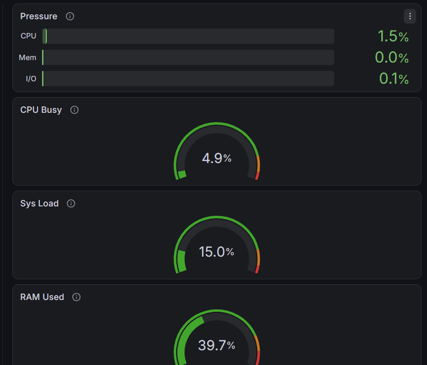
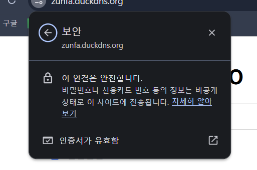
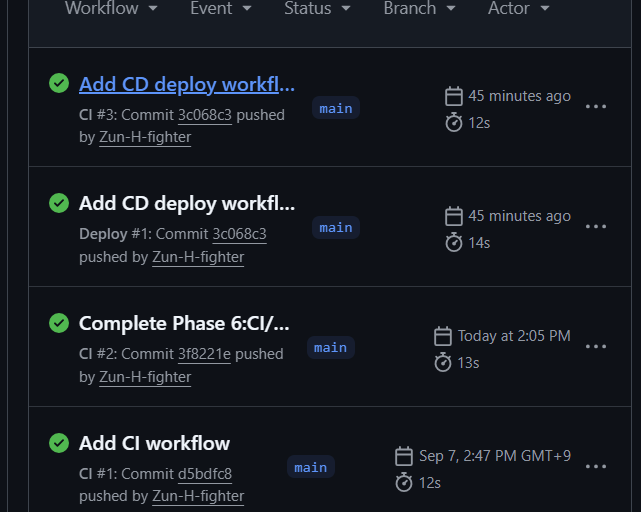
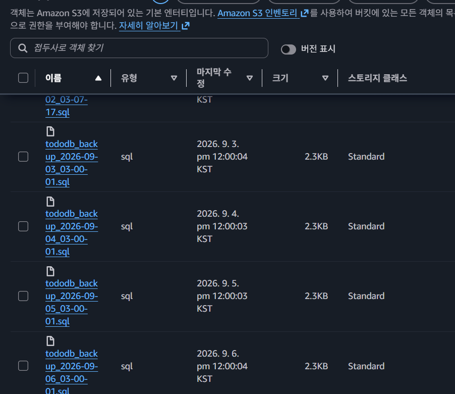

# hybrid-cloud-portfolio - TODO APP

Hetzner VPS(온프레미스 느낌)와 AWS(Cloud)를 연결한 하이브리드 인프라 위에
TODO 어플리케이션을 배포하고, IaC, 모니터링, CI/CD로 운영을 자동화하는 포트폴리오 프로젝트입니다.


## 프로젝트 목표

- 온프레미스(Hetzner)와 클라우드(AWS)를 연결하는 하이브리드 인프라 구성
- 모든 인프라를 코드로 관리하는 IaC(Terraform, Ansible) 실습
- 시스템 / 애플리케이션을 관측가능하게 하는 모니터링 스택 구축
- 배포를 자동화하는 CI/CD 파이프라인 구성

## 애플리케이션

간단한 TODO 앱으로, 하이브리드 인프라 위에서 실제로 동작하는 워크로드 역할을 합니다.

- 기능: 할 일 생성 / 조회 / 수정 / 삭제 (CRUD)
- 백엔드: Node.js (Express) REST API
- 프론트엔드: 간단한 웹 화면 (할 일 목록 확인 및 관리)
- 데이터베이스: PostgreSQL


## 기술 스택

| 구분 | 사용 기술 |
|------|-----------|
| 애플리케이션 | Node.js (Express), PostgreSQL |
| 컨테이너 | Docker, Docker Compose |
| 웹 서버 | Nginx (리버스 프록시, HTTPS) |
| 모니터링 | Prometheus, Node Exporter, Grafana |
| 클라우드 (AWS) | S3(백업), IAM(권한), CloudWatch(로그·메트릭) |
| IaC | Terraform(AWS), Ansible(서버 구성) |
| CI/CD | GitHub Actions |
| 인프라 | Hetzner Cloud VPS (Ubuntu 24.04, Falkenstein) |

## 인프라 구성

- Hetzner VPS: Nginx → Node.js 앱 → PostgreSQL을 Docker Compose로 운영,
  Prometheus/Grafana로 시스템·컨테이너 메트릭 수집
- AWS: DB 백업을 S3로 전송, IAM 최소권한 원칙으로 접근 제어,
  ~~CloudWatch로 온프레미스 로그·메트릭을 클라우드에서 관측~~

## 로드맵

- [v] **Phase 1** — Hetzner VPS 생성 및 보안 하드닝 (SSH 키 인증, 방화벽, fail2ban)
- [v] **Phase 2** — TODO 앱 개발 + Docker화, Nginx 리버스 프록시 + HTTPS
    - [v] TODO 앱 개발 (Express + PostgreSQL, CRUD)
    - [v] 웹 프론트엔드 (HTML/CSS/JS)
    - [v] Docker Compose로 앱 + DB 컨테이너화
    - [v] 서버에 배포
    - [v] Nginx 리버스 프록시
    - [v] HTTPS (도메인 확보 후)
- [v] **Phase 3** — Prometheus + Grafana 모니터링 스택 구축
- [v] **Phase 4** — AWS 연동
  - [v] 계정 보안 설정 (루트 MFA, 예산 알림, IAM 관리자 사용자)
  - [v] S3 백업 버킷 생성 (버저닝 활성화, 퍼블릭 액세스 차단)
  - [v] 최소권한 IAM 사용자 + 커스텀 정책 (백업 업로드 전용)
  - [v] 서버에서 S3로 자동 백업 스크립트
  - [X] ~~CloudWatch 로그·메트릭 연동~~ (Prometheus/Grafana로 대체, 향후 AWS 네이티브 프로젝트에서 다룰 예정)
- [v] **Phase 5** — Terraform(AWS) + Ansible(서버 구성)으로 IaC 전환
- [v] **Phase 6** — GitHub Actions CI/CD 파이프라인

## 진행 상황

TODO APP 포트폴리오 구성 완료.

## 스크린샷

| | |
|---|---|
|  실시간 모니터링 |  HTTPS 적용 |
|  자동 배포 |  일별 자동 백업(cron으로 매일 자동 백업됨!!) |

## 저장소 구조

```
├── app/                # Node.js(Express) TODO 앱 + Dockerfile
├── nginx/              # 리버스 프록시 설정
├── monitoring/         # Prometheus 설정
├── scripts/            # S3 백업 스크립트
├── terraform/          # AWS 인프라 코드 (IaC)
├── ansible/            # 서버 구성 자동화 playbook
├── docs/               # 아키텍처, 단계별 기록, 트러블슈팅
├── .github/workflows/  # CI(PR 검증) / CD(빌드 → GHCR → 배포)
├── docker-compose.yml
└── .env.example
```

## 개발 회고

이 프로젝트는 AI 어시스턴트(Claude Opus 4.8)의 가이드를 받으며 진행했습니다.
전체 아키텍처 설계 방향, 각 단계별 개념 학습, 트러블슈팅 과정에서
많은 도움과 방향 제시를 받았습니다.

다만 실제 구현(코드 작성, 서버 설정, 배포)과 발생한 문제의 원인 찾기, 해결은 직접 수행했으며 각 기술이 왜 필요하고 어떻게 동작하는 지를 이해하는데 집중했습니다. 단순히 따라 하기보다 개념을 짚어가며 진행한 기록은 docs/ 폴더에 있습니다.

문제 해결 과정과 그 사고방식은 [docs/troubleshooting.md](docs/troubleshooting.md)에 정리했습니다

## 작성자

[Zun_H_fighter] — [전북대 컴퓨터인공지능학부 / 클라우드·시스템 엔지니어 지망]